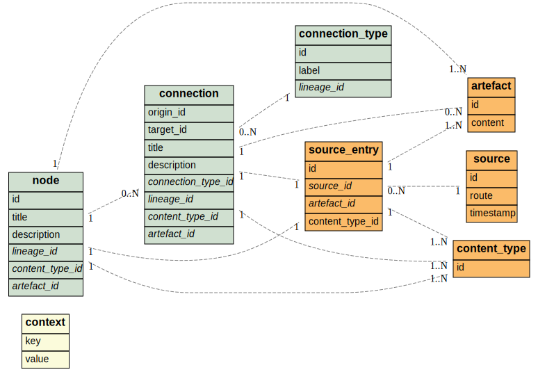

# Architecture

The [ongoing conversation](https://github.com/onelocom/onelo/issues/16) should
inform the evolution of this document.

Onelo is a transformation pipeline starting with a set of files and ending
with another set of files.

The phases are:

* **Prelude**: Set up contextual information such as the version of Onelo.
* **Sourcing**: Gather all relevant information given a source (e.g. a directory).
* **Extraction**: Parse all source entries, extract and generate the directed
  graph.
* **Transformation**: Apply tranformation rules to generate the desired
  output.

## Cache data model

The cache is a SQLite database with the following set of tables:

## Resources

* [Kroki](https://kroki.io/).
* [Camunda BPMN modeler](https://camunda.com/products/camunda-bpm/modeler/).
